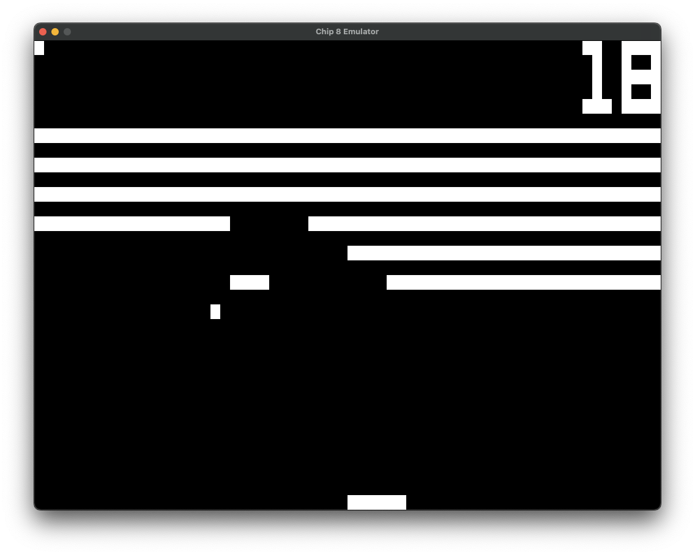

## Chip 8 Emulator

[Chip-8](https://en.wikipedia.org/wiki/CHIP-8)  
<figure>
  
  <figcaption>Breakout running on the emulator</figcaption>
</figure>  

## How to use

### Loading a ROM

#### Through CLI

`cargo run <path_to_rom>`

#### Dragging a file

Drag and drop a ROM onto the window once running

### Default keys

#### Chip8 keypad mappings

| Keyboard | Chip8 |
|----------|-------|
| 0        | 0     |
| 1        | 1     |
| 2        | 2     |
| 3        | 3     |
| 4        | 4     |
| 5        | 5     |
| 6        | 6     |
| 7        | 7     |
| 8        | 8     |
| 9        | 9     |
| A        | A     |
| B        | B     |
| C        | C     |
| D        | D     |
| E        | E     |
| F        | F     |

#### Other

| Keyboard | Action             |
|----------|--------------------|
| p        | Toggle execution   |
| n        | Step 1 instruction |

## Dependencies

### Linux

`sudo apt-get install libsdl2-dev`

### Mac

`brew install sdl2`
